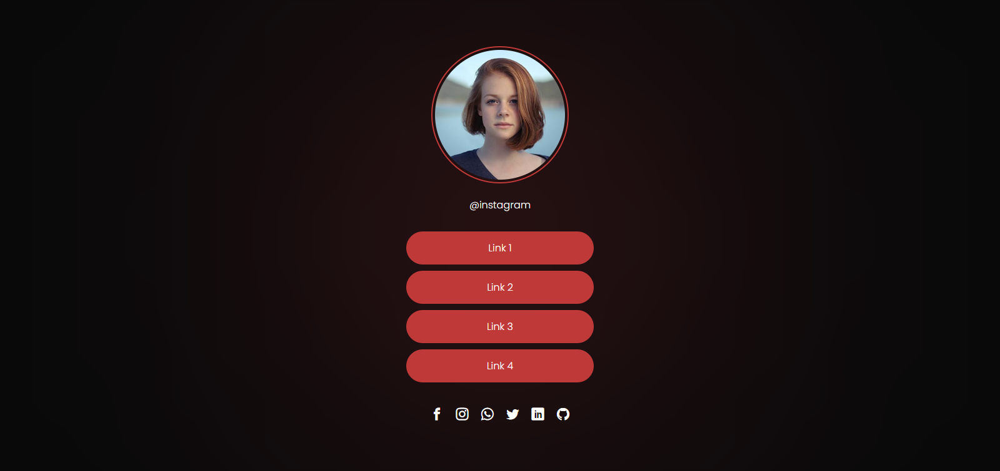

<h1>SocialTree</h1>

Challenge created by Rocketseat :purple_heart:

The objective of this challenge was to create a simple HTML/CSS page aimed at social networks, with the focus of centralizing all communication channels and redirecting it to their respective locations.

We use a structure with few codes, trying to make it as simple as possible for any lay user to manage and update it.

<h2>We use it in the project</h2>

In addition to all the necessary base, we use some knowledge such as:

<ul>
<li>Flexbox</li>
<li>CSS variables</li>
</ul>

-- Developed by <a href="https://github.com/juninhomorais/">Juninho Morais</a>
